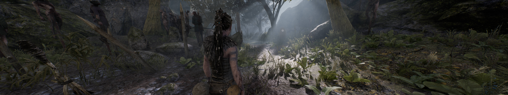

## Hellblade: Senua's Sacrifice FOV changer

The game was [updated](https://store.steampowered.com/news/app/414340/view/3126057906323904820) with official ultrawide support on December 7, 2021, making the original solution posted here obsolete.

The new version of the tool is a simple field of view changer for any resolution.

1. [Download](/../../releases) and unpack the archive.
2. Launch the game first, followed by the tool.
3. Press the hotkeys as shown.

All trainers based on CE components may trigger some anti-virus software.

Tested on the latest Steam version at 2560x1080 and 11520x1080.

